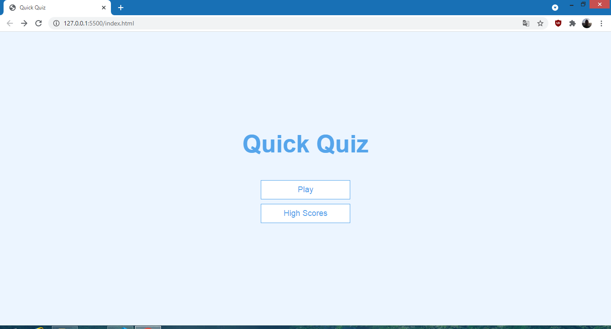
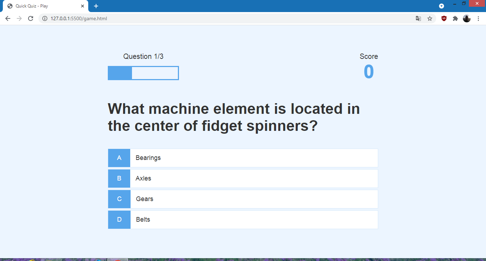
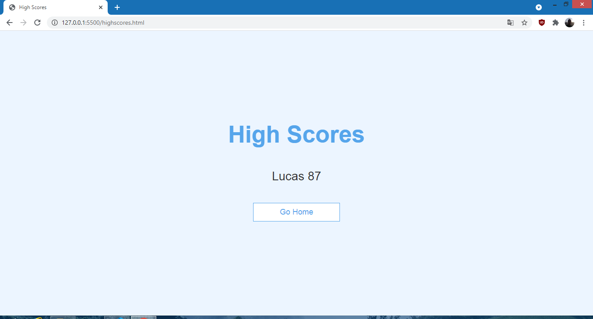

<h1 align="center">Javascript Quiz</h1>

Quiz desenvolvido usando as tecnologias de HTML5, CSS3, e JS EC6(EcmaScript 6)

  

<h2>Tabela de conteúdos</h2>

    <a href="#objetivo">Objetivo</a>
    <a href="#tecnologias">Tecnologias Utilizadas</a>
    <a href="#contribuicao">Contribuição</a>
    <a href="#autor">Autor</a>

<h2>Conteúdo</h2>

<h3>Objetivo</h3>

O objetivo desta simples aplicação é apenas aprender Javascript puro, Acredito que antes de se aprender tecnologias como React, Angular e Vue é preciso dominar uma boa parte do que chamamos de Vanilla Javascript que é o nosso javascript puro, e ainda aprender conceitos de estilização usando o CSS3

<h3>Tecnologias Utilizadas</h3>

Foram utilizadas tecnologias do desenvolvimento web, tais como, HTML5, CSS3, Javascript(EcmaScript 6), ainda conta com um recurso que consome uma API externa(Open Trivia Database) que fornece as perguntas e respostas necessárias para o funcionamento do quizz, e utiliza o armazenamento local do navegador, o Local Storage, que armazena dados sem a necessidade de se enviar para o lado do servidor

<h3>Contribuição</h3>

Quero agradecer ao Youtuber e Desenvolvedor <em>James Q Quick</em> por postar uma série de vídeos ensinando a como desenvolver um quizz. Link para a playlist de vídeos: <a href="https://www.youtube.com/playlist?list=PLDlWc9AfQBfZIkdVaOQXi1tizJeNJipEx">Clique aqui</a>

<h3>Autor</h3>

Lucas Brito, como o auxílio de James Q Quick

Projeto Finalizado

<h2>Algumas Telas</h2>
</img>
</img>
</img>